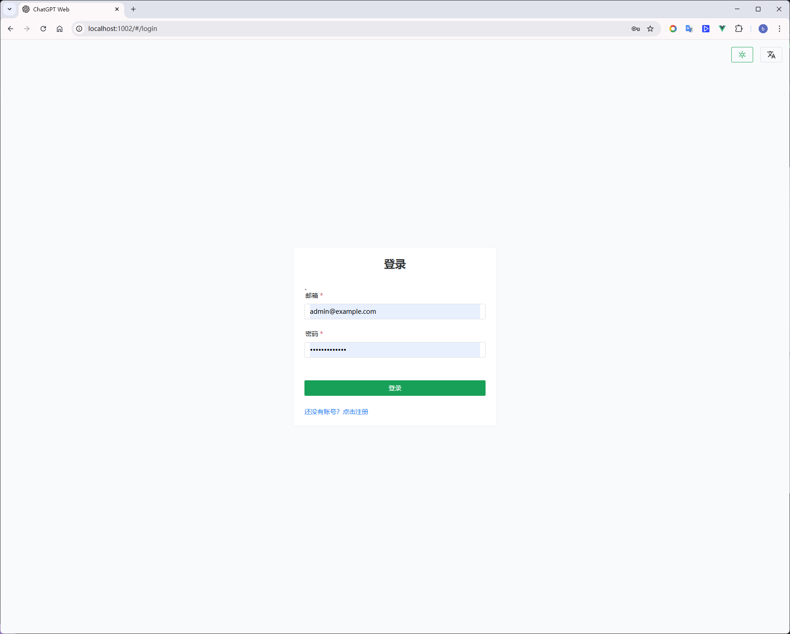
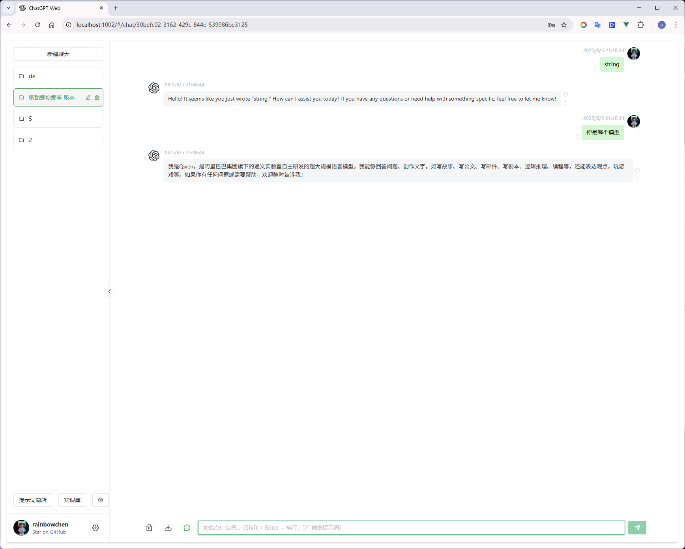
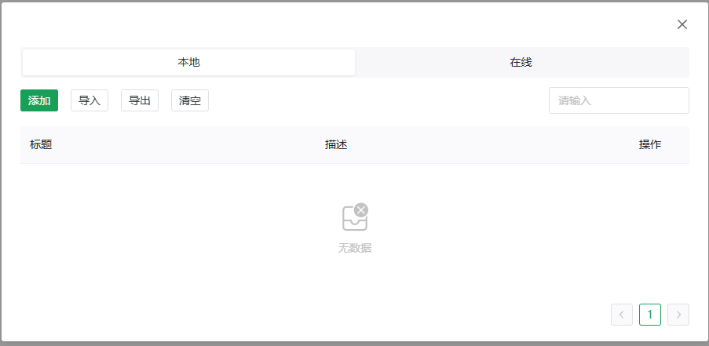
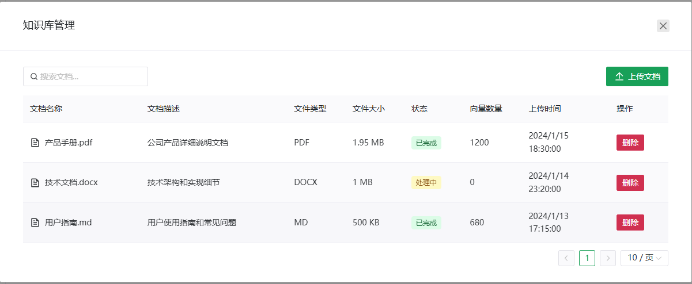
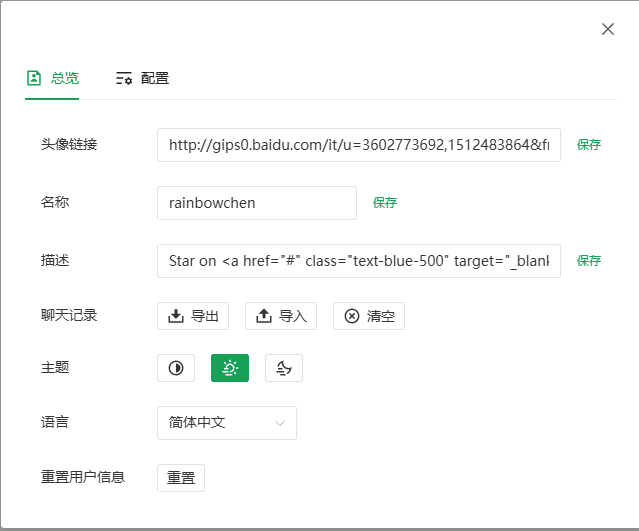

# AI Agent 智能对话系统

一个基于 FastAPI + Vue3 的现代化 AI 对话系统，集成了 LangGraph 工作流和知识库管理功能。

## 📋 目录

- [项目概述](#项目概述)
- [技术栈](#技术栈)
- [功能特性](#功能特性)
- [快速开始](#快速开始)
- [项目结构](#项目结构)

## 🎯 项目概述

AI Agent 是一个功能完整的智能对话系统，具备以下核心能力：

- 🤖 **智能对话**: 基于 LangChain 和 LangGraph 的 AI 对话引擎
- 📚 **知识库管理**: 支持文档上传、向量化存储和智能检索
- 🔐 **用户认证**: JWT 身份验证和权限管理
- 🌐 **现代化界面**: 基于 Vue3 + TypeScript 的响应式前端
- 📊 **实时监控**: 完整的日志记录

## 🛠 技术栈

### 后端技术栈

- **框架**: FastAPI (高性能异步 API 框架)
- **AI 引擎**: LangChain + LangGraph (AI 工作流)
- **数据库**: PostgreSQL (主数据库) + Chroma (向量数据库)
- **认证**: JWT + bcrypt (安全身份验证)
- **包管理**: uv (快速 Python 包管理)
- **API 文档**: 自动生成 Swagger/OpenAPI 文档

### 前端技术栈

- **框架**: Vue 3 + TypeScript
- **状态管理**: Pinia
- **路由**: Vue Router 4
- **UI 组件**: Naive UI
- **构建工具**: Vite
- **包管理**: pnpm

## ✨ 功能特性

### 核心功能

- 🔐 **用户认证系统**

  - JWT 令牌认证
  - 用户注册/登录
  - 权限管理

- 💬 **智能对话**

  - 多轮对话支持
  - 上下文记忆
  - 流式响应
  - 对话历史管理

- 📚 **知识库系统**
  - 多格式文档上传 (PDF, Word, TXT, Markdown)
  - 文档向量化处理
  - 智能检索和问答
  - 文档管理界面

### 安全特性

- 🔒 **输入验证**: 防止 XSS 攻击
- 🛡️ **速率限制**: 基于 slowapi 的请求限制
- 🔐 **数据加密**: 密码加密存储[暂未实现]
- 🚫 **SQL 注入防护**: 参数化查询

### 开发体验

- 📝 **完整日志**: 结构化日志记录
- 🔧 **热重载**: 开发环境自动重载
- 📊 **性能监控**: 请求性能追踪
- 🌍 **国际化**: 多语言支持

## 🚀 快速开始

### 环境要求

- **Python**: 3.13+
- **Node.js**: 18+
- **PostgreSQL**: 14+
- **包管理器**: uv (后端), pnpm (前端)

### 1. 克隆项目

```bash
git clone <repository-url>
cd ai-agent
```

### 2. 后端设置

#### 安装依赖

```bash
# 使用 uv 安装 Python 依赖
uv sync
```

#### 环境配置

```bash
# 复制环境配置文件
cp .env.example .env.development

# 编辑配置文件，设置数据库连接等信息
# 主要配置项：
# - POSTGRES_URL: PostgreSQL 数据库连接
# - OPENAI_API_KEY: OpenAI API 密钥
# - JWT_SECRET_KEY: JWT 密钥
```

#### 启动后端服务

```bash

# 或手动启动
source scripts/set_env.sh development
uv run uvicorn app.main:app --reload --port 8000
```

访问 API 文档: http://localhost:8000/docs

### 3. 前端设置

```bash
# 进入前端目录
cd fronted

# 安装依赖
pnpm install

# 启动开发服务器
pnpm dev
```

访问前端应用: http://localhost:5173

## 📁 项目结构

```
ai-agent/
├── app/                    # 后端应用
│   ├── api/               # API 路由
│   │   └── v1/           # API v1 版本
│   ├── core/             # 核心模块
│   │   ├── config.py     # 配置管理
│   │   ├── langgraph/    # LangGraph 工作流
│   │   └── prompts/      # 提示词模板
│   ├── models/           # 数据模型
│   ├── schemas/          # Pydantic 模式
│   ├── services/         # 业务服务
│   └── utils/            # 工具函数
├── fronted/              # 前端应用
│   ├── src/
│   │   ├── components/   # Vue 组件
│   │   ├── views/        # 页面视图
│   │   ├── store/        # Pinia 状态管理
│   │   └── api/          # API 接口
│   └── package.json
├── scripts/              # 部署脚本
├── pyproject.toml        # Python 项目配置
```

### 数据库操作

```bash
# 查看数据库模式
cat schema.sql

# 数据库迁移 (待实现)
# make migrate
```

## 📚 知识库功能

### 功能概述

知识库系统允许用户上传和管理文档，这些文档将被处理并存储为向量数据，用于增强 AI 对话的上下文理解能力。

### 支持格式

- **文档格式**: PDF、Word (.doc/.docx)、TXT、Markdown (.md)
- **上传方式**: 拖拽上传或点击选择文件
- **文件大小**: 根据后端配置调整

### 使用方法

1. **访问知识库**: 在聊天页面左侧边栏找到"知识库"按钮
2. **上传文档**: 点击"上传文档"，选择文件并添加描述
3. **管理文档**: 查看、搜索、删除已上传的文档

### 技术实现

- **前端**: Vue3 组件 + Naive UI
- **后端**: Chroma 向量数据库 + 文档解析
- **状态管理**: Pinia 状态管理
- **国际化**: vuei18n 支持中英文切换

### 效果图







**注意**: 本项目正在积极开发中，部分功能可能尚未完全实现
